# brack[it]
A bracket-based tool that gamifies group decision making.

### Visit
* You can visit the deployed site at the following URL: https://brack-it.herokuapp.com/
* *NB:* brack[it] is designed to be mobile-friendly in order to maximize its utility as a convenient tool to expedite group decision making. It is highly recommended that the user visit the site on a mobile device in order to get the most convenient, user-friendly, and aesthetically optimized experience.

### Overview
Brack[it] facilitates and gamifies the process of making a decision as a group by setting up a bracket of choices for the group to vote on together, in real time. What might otherwise be an overwhelming panoply of choices is divided into pairs, or "matchups," thus allowing the group to narrow down the options to a single winner via a series of manageable binary choices that each member of the group makes individually. Instead of arguing back and forth, weighing numerous pros and cons, and complicating matters further by introducing new options just as the group is about to reach a consensus, a group of users can simply set up a bracket and rapidly reach a decision after a few rounds of voting.

### Technical Approach
The app is built according to MVC (model-view-controller) architecture and makes use of the following technologies:
* Sequelize
    - Sequelize is used to create the *models* – i.e., the tables storing user data. These include admins (those who set up the brackets), brackets, candidates (the choices being voted on), matchups (the pairs of choices that users vote on), users, and votes. In addition to creating these models, Sequelize is also used as an ORM (object-relational mapper) to build the functions that manipulate data – e.g., to assemble matchups from the pool of candidates, to narrow down the pool of candidates remaining each round to the previous round's winners, etc. Thus, Sequelize queries play a part in the *controller* aspect of the MVC architecture.
* Handlebars
    - Handlebars is used as a view engine to render the *views* – i.e., the app's many pages. Mustache syntax {{ }} is used for conditional rendering based on user data.
* Express
    - A Node.js-Express server handles the API and page routes that govern the app's workflow.
* Socket.IO
    - Socket.IO events are used to coordinate the various individual group members' activities – e.g., joining a bracket or voting on a matchup – so that these events occur simultaneously and, where applicable, according to a universal timer that all users voting on the same bracket share. This enhances the gamification aspect of the app and also makes it more convenient to reach a decision rapidly by ensuring that the users vote together in real time instead of submitting votes and potentially waiting a long time for other users to submit theirs.
* jQuery
    - jQuery is used to facilitate the transmission of information between the database and the HTML on the page – e.g., by grabbing candidate names from the page when the admin sets up a new bracket and adds candidates.

### Demo

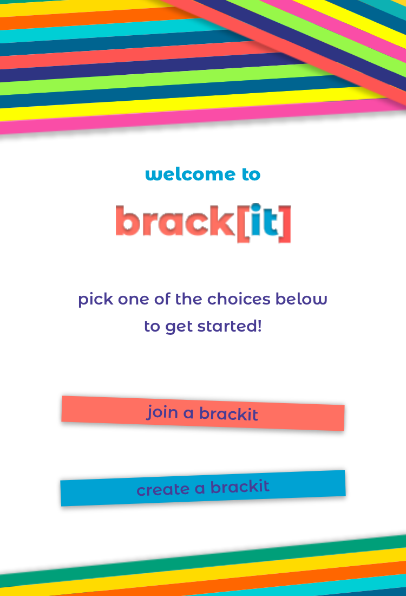

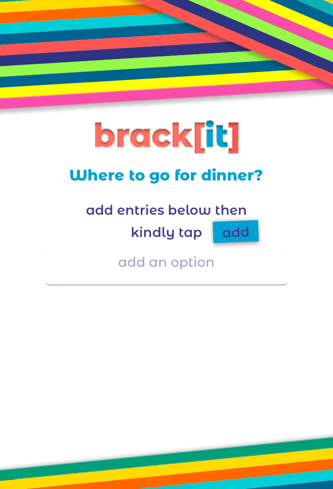

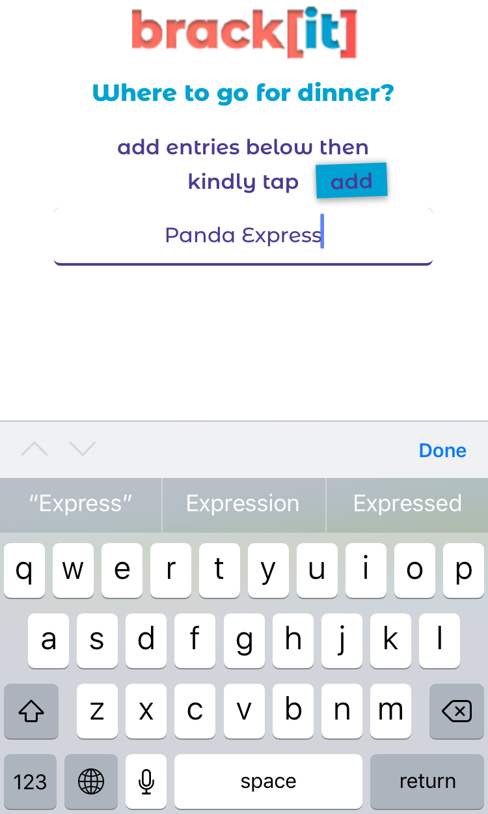

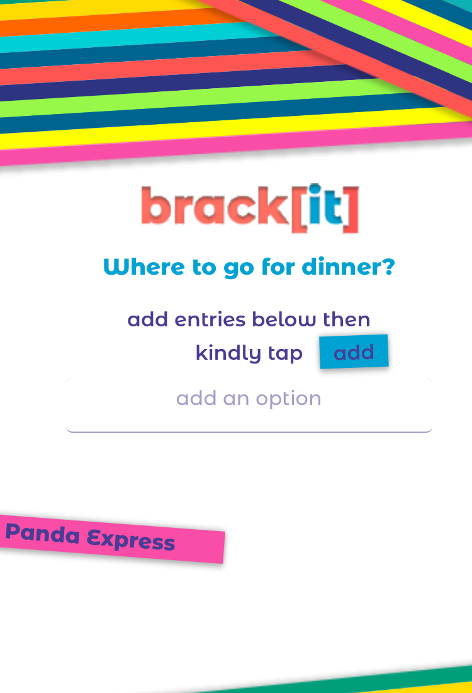

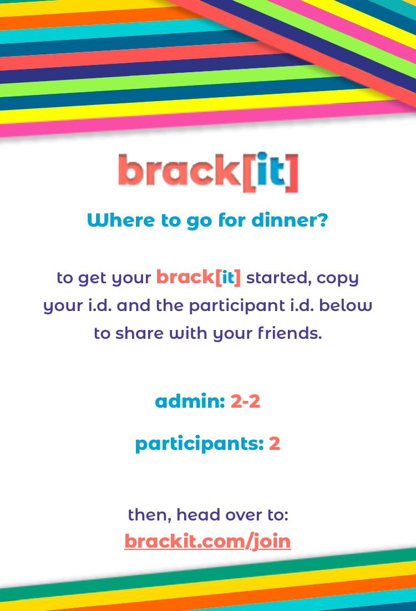

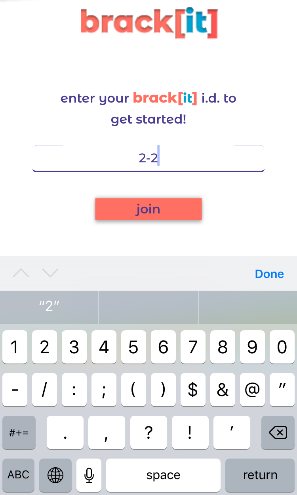

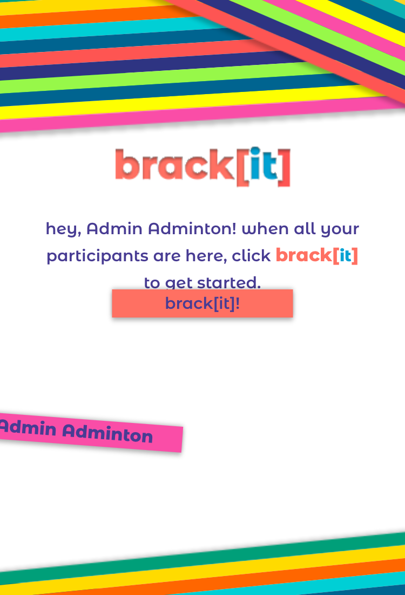

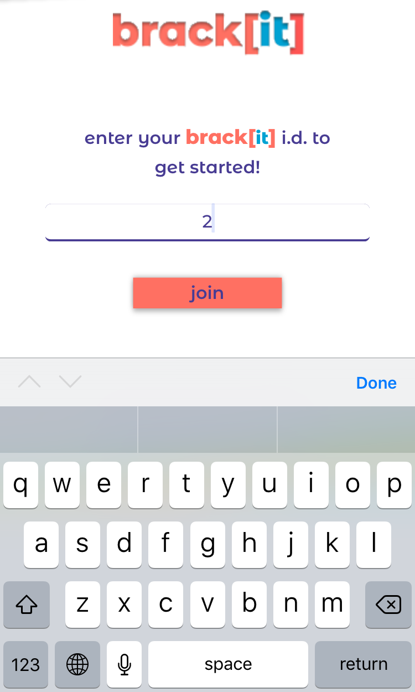

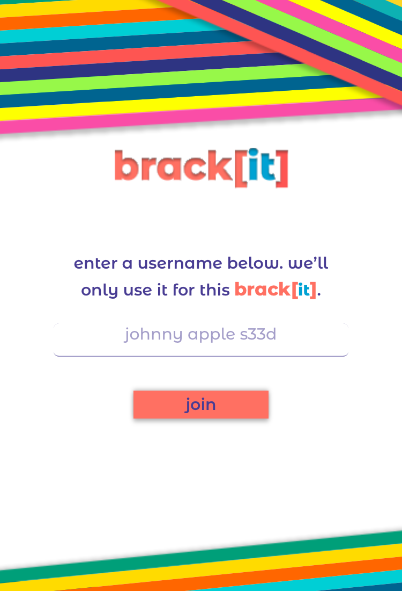

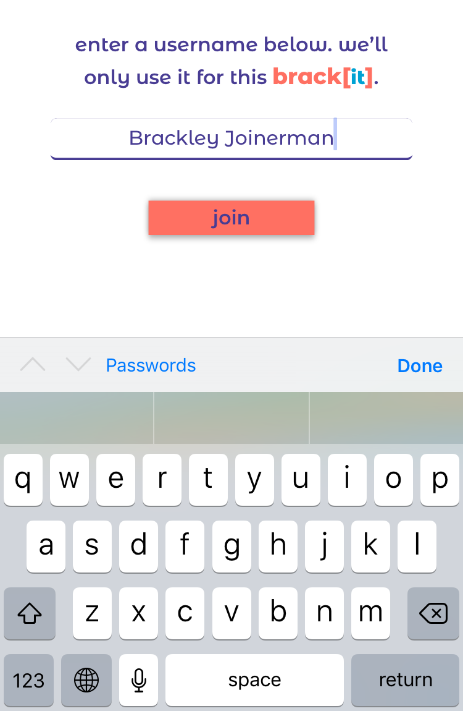

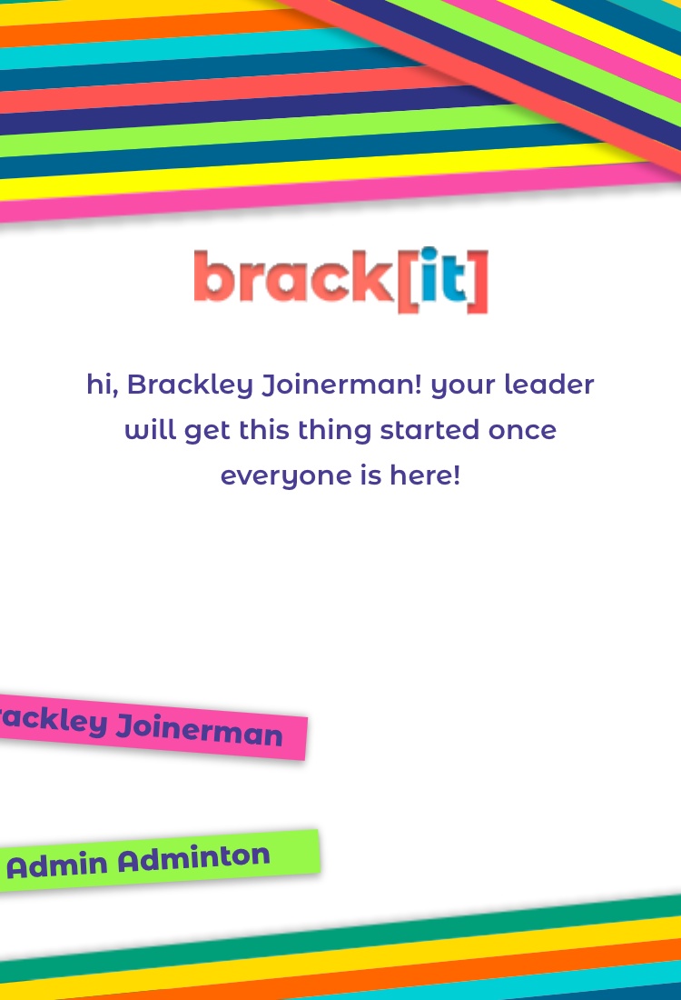

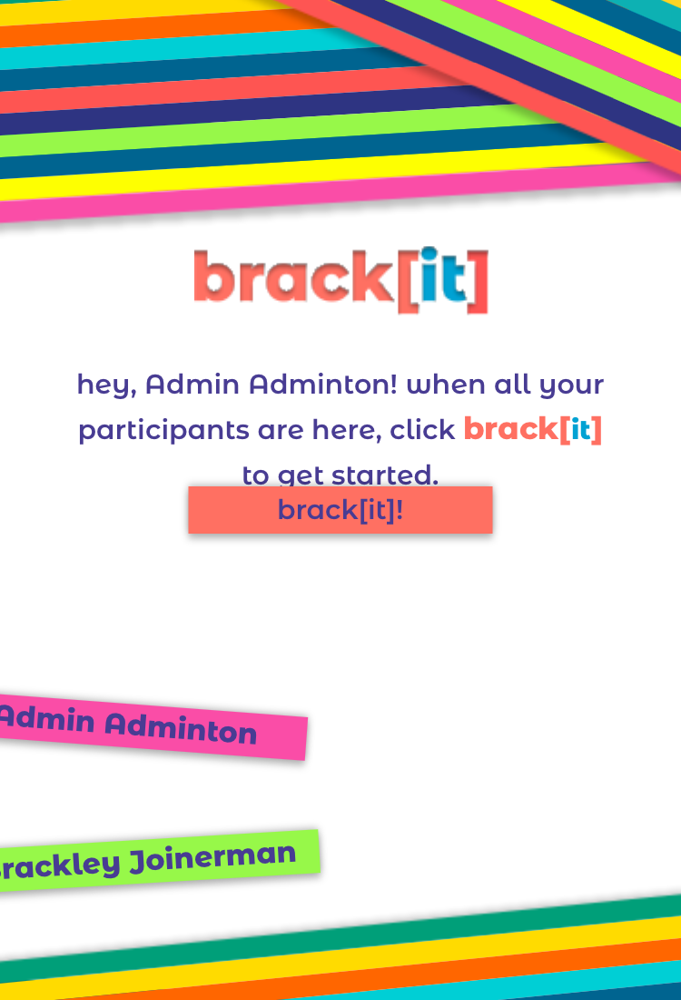

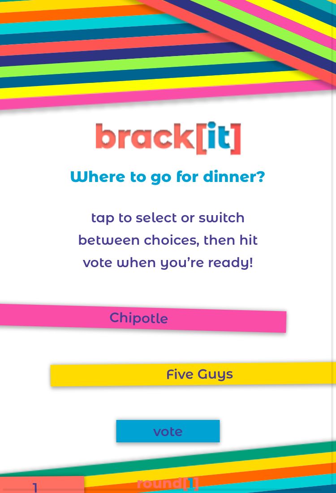

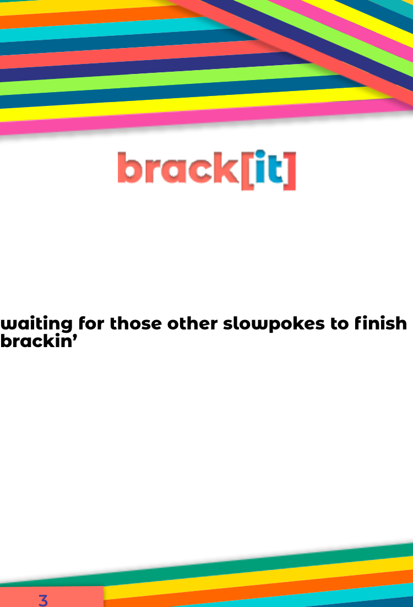

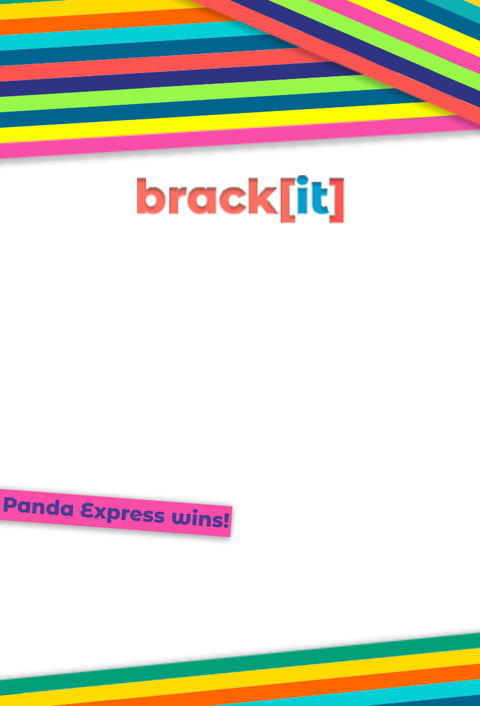
